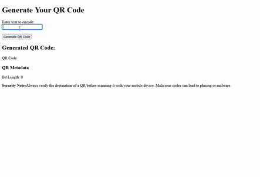

group project

# QR Code Data Encoder

This project features a set of Python scripts designed to take user input text, encode it into a binary format suitable for a QR code, apply Reed-Solomon error correction, and prepare it for QR code generation. A **Flask web server** handles user input.

---

## Project Structure

The project consists of the following Python files:

* **`app.py`**: The main Flask application. It handles web requests, orchestrates the encoding process, and currently prepares a placeholder for the QR code image.
* **`encoder.py`**: Contains functions for converting text to a binary string, padding the binary string to meet QR code version capacity, and converting the padded binary string into data codewords.
* **`reedsoloimplementation.py`**: Implements Reed-Solomon error correction encoding using the `reedsolo` library.

---

## File Descriptions

### `app.py`

This script sets up a simple Flask web server.

* **Route: `/` (GET, POST)**
    * **GET**: Renders an HTML page (`index.html` - not provided, but assumed to exist) that likely contains a form for text input.
    * **POST**:
        * Receives text input from the user (`qr_text`).
        * Calls `encoder.encode_text()` to convert the input text into a raw bit string and get its initial length.
        * Calls `encoder.pad_data()` to pad the bit string according to **QR code version 1, level L capacity requirements**. This includes adding a terminator, ensuring byte alignment, and adding padding bytes (alternating 236 and 17) until the capacity is met.
        * Calls `encoder.bits_to_codewords()` to convert the padded bit string into a list of 8-bit integer codewords.
        * Calls `reedsoloimplementation.apply_reed_solo()` to apply **Reed-Solomon error correction** to the data codewords, generating error correction codewords.
        * The `encoded_output` (which includes data and error correction codewords) and the `bit_length` (of the padded data) are then passed to the `index.html` template for display.
        * Currently, it includes a placeholder for actual QR code image generation (`qr_image_stream = io.BytesIO(b"Placeholder QR Code Data")`). This part would need to be replaced with a library or function that generates a visual QR code from the `encoded_output`.

### `encoder.py`

This module provides functions for the initial stages of QR code data encoding.

* **`encode_text(text)`**:
    * Takes a string `text` as input.
    * Encodes the text into **UTF-8 bytes**.
    * Converts each byte into its 8-bit binary representation.
    * Concatenates these binary strings to form a single binary string.
    * Returns the binary string and its length in bits.
* **`len_encoder_text(text)`**:
    * Calculates and returns the bit length of the UTF-8 encoded text.
* **`VERSION_1_LEVEL_L_CAPACITY_BITS`**:
    * A constant representing the total number of data bits available for a **Version 1, Error Correction Level L QR code** (currently set to 152). This value is crucial for padding.
* **`pad_data(bit_string, capacity_bits)`**:
    * Takes the raw `bit_string` and the target `capacity_bits` as input.
    * Appends a `'0000'` terminator sequence.
    * Pads the string with `'0'`s to make its length a multiple of 8.
    * Alternately appends pad bytes (binary representations of 236 and 17) until the `bit_string` reaches `capacity_bits`.
    * Returns the padded bit string, truncated to `capacity_bits` if it exceeds it.
* **`bits_to_codewords(padded_bits)`**:
    * Takes the `padded_bits` string as input.
    * Divides the string into 8-bit chunks.
    * Converts each chunk into its integer equivalent.
    * Returns a list of these integer codewords.

### `reedsoloimplementation.py`

This module is responsible for applying Reed-Solomon error correction.

* **`apply_reed_solo(data_codewords)`**:
    * Takes a list of `data_codewords` (integers) as input.
    * Initializes a Reed-Solomon codec (`reedsolo.RSCodec`) with an error correction capability of **7 bytes** (this implies that 14 error correction codewords will be generated, as Reed-Solomon typically generates $2 \times t$ error correction symbols for $t$ correctable errors).
    * Encodes the `data_codewords` using the `rs.encode()` method. This appends the error correction codewords to the data codewords.
    * Returns the combined list of data and error correction codewords.

---

## How it Works (Overall Flow)

1.  The user submits text via a web form served by `app.py`.
2.  `app.py` takes this text and passes it to `encoder.py`.
3.  `encoder.py` converts the text to a binary string (`encode_text`).
4.  This binary string is then padded to meet the specific capacity of a QR code version (e.g., Version 1, Level L) using `pad_data`. This involves adding a terminator, ensuring byte alignment, and adding specific padding bytes.
5.  The padded binary string is converted into a sequence of 8-bit integer codewords by `bits_to_codewords`.
6.  These data codewords are then passed to `reedsoloimplementation.py`.
7.  `reedsoloimplementation.apply_reed_solo()` calculates and appends **Reed-Solomon error correction codewords** to the data codewords.
8.  The final list of codewords (data + error correction) is returned to `app.py`.
9.  `app.py` then (conceptually) would use these codewords to generate a QR code image. Currently, it only displays the encoded data and bit length.

---

## Dependencies

* **Flask** (`pip install Flask`)
* **reedsolo** (`pip install reedsolo`)
* **Pillow** (`pip install pillow`)

---

## To Run

1.  Ensure you have Python and the listed dependencies installed.
2.  You will need an `index.html` file in a `templates` directory alongside `app.py`. This HTML file should include a form with a field named `qr_text` and display `encoded_output` and `bit_length`.
3.  Run the Flask application: `python app.py`
4.  Open a web browser and navigate to `http://127.0.0.1:5000/`.

## social, legal and ethical 
though out the design and creation of the qr code we have had to consider the social legal and ethical dilemmas
the main ones being accessiblity misuse and tammpering
we have to consider that not everyone will have access to the qr code. they rely entirly on having access to a camra that can scan a qr code.
not every person will have a camra that is able to scan a qr code. however we are unable to do anything.
we also have to consider that qr can be used to plant malware or be used as phising scams haveing unsuspeting victum scan them.
we are able to help mitigate the chances of this by having messages and warning pop up about the potentional hazard of qr codes

--- 
## weaknesses
the main weakness of the system is that because the user is able to enter a string or link to a site they can implant a site that could install malware onto a device

---

### Programming Paradigms

This project primarily utilizes an **imperative programming** style. Functions directly manipulate shared data structures (like the QR code matrix, which is a list of lists) through explicit step-by-step instructions.

There are also elements of **functional programming**, particularly in utility functions that aim to be pure (e.g., `get_mode_indicator`, `bits_to_codewords`), transforming inputs to outputs without side effects.

Currently, the project does not extensively employ **object-oriented programming**, as there are no custom classes defined to encapsulate complex data and behavior

---

### User Input Management

User input is managed through the flask interface
* A HTML form captures the users text when the form is submitted
* When the form is submitted, the Flask server receives the form data, and the text is accessed in app.py via Flask's request.form['qr_text']
* The retrieved text is directly passed to the qr code functions 

---

### GIF

### features
There are numerous applications for QR codes. One of the most recent uses is using them to show menus and order food.
Ours can be used for the same purpose. We can add the URL of the websites and place the QR code on the tables for customers to order food and view the menu.

### evidence

Test string: hi 
Reed-Solomon encoded codewords: [64, 38, 134, 144, 236, 17, 236, 17, 236, 17, 236, 17, 236, 17, 236, 17, 236, 17, 236, 244, 219, 18, 20, 171, 219, 56]
